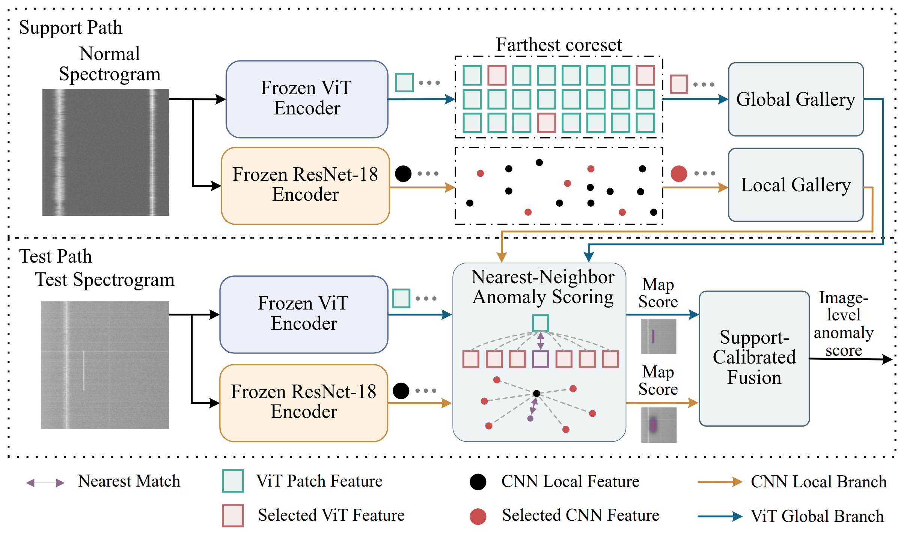

# SpectraMemAD: Dual-Scale Normal Memory for Training-Free Few-Shot Spectrum Anomaly Detection

## 摘要

*[待下一步撰写]*

**关键词—** *[待下一步确定]*

## I. 引言

无线频谱监测通过分析功率谱和时频观测，识别非法发射、非预期干扰、设备故障和频谱误用。这些异常会改变合法业务的功率分布或时频结构，并影响通信质量与频谱使用。检测器因此需要识别偏离正常通信状态的频谱观测。

实际部署中，检测器迁移到新的站点或工作频段后，初期只有少量正常频谱图，异常样本尚未出现。同时，噪声底、合法业务占用等条件随场景改变，正常模式无法提前固定。此时，监督学习因缺少异常标注而无法应用，少量正常样本也不足以支撑重新训练。因此，本文研究**少样本正常冷启动频谱异常检测**：仅使用目标场景的少量正常频谱图建立正常参考，并对后续观测进行逐样本检测。

现有频谱异常检测方法主要分为统计检测和数据驱动建模。能量检测、恒虚警检测和基于统计分布的信息论检测方法根据功率、背景分布或传播规律构造检测统计量[1]–[4]，其阈值和背景模型需要随噪声水平、频段占用和接收条件校准。数据驱动方法则从频谱数据中学习表示、重构模型或判别规则。SAIFE使用对抗自编码器学习功率谱表示[5]；IAD-PER和基于VAE的噪声底加权重构方法根据重构差异检测频谱异常[6], [7]；时空预测方法使用历史序列的预测残差[8]；TFAM-AAE先利用频谱重构误差检测明显异常，再利用IQ指纹与合法用户中心的距离识别难检异常[9]。UDMA、GRETEL和MARD进一步引入知识蒸馏与记忆增强[10]、图结构建模[11]和多传感器信息[12]。这些方法在目标场景中的应用仍依赖统计量校准、模型训练或参数更新，尚未解决仅凭少量正常参考、固定模型参数的冷启动检测问题。

针对上述问题，本文提出 **SpectraMemAD**，将目标场景适配从参数学习转向记忆学习。该方法固定预训练编码器参数，仅由少量正常频谱图构建目标场景记忆。Transformer分支和卷积分支分别提取整体时频结构与局部纹理特征，建立双尺度正常记忆；待测频谱图在两类正常记忆中近邻检索，得到全局与局部异常分数。进一步，本文利用正常参考样本的分数分布校准两条分支的分数，仅当局部分支的分数明显超出正常范围，且提供强于全局分支的异常证据时，才修正最终分数。由此，场景知识由可更新的正常记忆承载，部署过程无需异常样本，也不更新目标场景参数。

本文其余部分组织如下：第II节定义少样本正常冷启动检测问题，第III节介绍所提方法，第IV节报告实验结果，第V节总结全文。

## II. 问题定义

本文研究目标场景中的少样本频谱异常检测。给定由$K$个已确认正常的频谱观测组成的正常参考集
$\mathcal{S}=\{x_i\}_{i=1}^{K}$，检测器利用$\mathcal{S}$建立目标场景的正常参考，并对待测频谱观测$x$进行异常评分。部署初期不提供异常样本，预训练编码器的参数保持固定，各待测观测独立处理。

频谱异常主要表现为两类变化。一类改变整体时频布局，如占用位置、带宽或持续时间发生变化；另一类仅出现在局部时频区域，如短时、窄带或弱功率干扰。由正常参考集$\mathcal{S}$确定的评分函数$s(x)$衡量待测观测偏离正常状态的程度，分数越大表示异常可能性越高。对应的判决规则为

$$
\hat{y}(x)=\mathbf{1}\{s(x)>\delta\},\tag{1}
$$

其中，$\hat{y}(x)=1$表示$x$被判定为异常，$\delta$为异常判决阈值。本文的目标是在不使用异常训练样本、不更新目标场景模型参数的条件下，利用少量正常参考同时识别整体结构异常和局部干扰异常。

## III. 方法

### A. 总体流程

当部署环境、工作频段或合法业务占用模式发生变化时，系统使用少量经确认的正常频谱图建立
目标场景的正常记忆，随后对待测频谱图逐张评分。场景适配仅涉及正常特征提取、记忆构建和
近邻检索，不更新预训练编码器参数。

图1给出SpectraMemAD的总体流程。正常参考图经过双分支编码后建立全局与局部正常记忆；待测图
在两类记忆中分别进行近邻匹配，所得异常分数经正常参考校准后融合。

*图1 本文整体架构*

### B. 频谱感知双尺度正常记忆

频谱图中的异常既可能改变整体占用布局，也可能仅形成局部纹理。为覆盖这两种变化，冻结的视觉
Transformer $f_V$提取跨时间、跨频带的整体时频结构特征，冻结的卷积网络$f_C$提取亮线、
脉冲、边缘和纹理突变等局部特征。两条分支分别建立正常记忆并独立评分，最后在分数层融合。

对于第$i$张正常参考图$x_i$，两条分支分别提取整体结构特征$\mathbf{v}_i$和局部纹理特征
$\mathbf{c}_i$：

$$
\mathbf{v}_i=f_V(x_i),\qquad \mathbf{c}_i=f_C(x_i),\qquad i=1,\ldots,K.
$$

将$K$张正常参考图的ViT和CNN特征分别汇总为$\mathbf{F}_V$和$\mathbf{F}_C$。两类正常记忆定义为

$$
\mathcal{M}_V=\operatorname{Coreset}_{r}(\mathbf{F}_V),
\qquad
\mathcal{M}_C=\operatorname{Coreset}_{r}(\mathbf{F}_C).\tag{2}
$$

每张正常参考图会产生大量特征，其中许多特征彼此相似。为减少这部分重复，本文采用最远点选择
构建代表性特征子集（coreset）。算法先选取一个正常特征作为起点，之后每次从剩余特征中选择
与当前子集差异最大的特征，重复该过程，直至保留$r$比例的特征。最终子集包含不同正常模式的
代表性特征，并作为正常记忆。

令$\mathbf{u}$表示一个待测特征，正常记忆$\mathcal{M}$包含$N$个正常特征，
$\mathbf{m}_j$表示其中第$j$个特征。待测特征的异常距离定义为

$$
d(\mathbf{u},\mathcal{M})
=\min_{j=1,\ldots,N}\delta_{\mathrm{cos}}(\mathbf{u},\mathbf{m}_j).\tag{3}
$$

其中，$\delta_{\mathrm{cos}}$为余弦距离。式(3)计算$\mathbf{u}$与$N$个正常特征的距离，
并保留最小值，即最近正常特征的距离。ViT分支使用$\mathbf{u}_V$和$\mathcal{M}_V$，CNN分支使用
$\mathbf{u}_C$和$\mathcal{M}_C$。如果这个最小距离仍然较大，说明正常记忆中没有与待测特征相似的
模式，该特征更可能异常。按照第IV-A节的图像级汇总规则聚合局部距离，得到ViT整体结构分数
$V(x)$和CNN局部纹理分数$C(x)$。两个分支在分数层融合，因而无需直接拼接不同尺度的特征。

### C. 正常参考校准融合

两条分支的原始分数尺度不同，不能直接比较。本文利用正常参考图产生的分数描述各分支在正常
状态下的波动范围，并将ViT分数$V(x)$作为基础判断、CNN分数$C(x)$作为补充证据。两条分支的
正常参考分数集合分别记为$\mathcal{R}_V$和$\mathcal{R}_C$。这些分数采用留一法计算：对正常
参考图$x_i$评分时，从候选正常特征中排除$x_i$自身的对应特征，避免精确自匹配产生零距离。

使用正常参考分数的中位数和四分位距，分别对ViT和CNN分数进行稳健标准化：

$$
z_V(x)=\frac{V(x)-\operatorname{median}(\mathcal{R}_V)}
{\max\{\operatorname{IQR}(\mathcal{R}_V),\epsilon\}},\tag{4a}
$$

$$
z_C(x)=\frac{C(x)-\operatorname{median}(\mathcal{R}_C)}
{\max\{\operatorname{IQR}(\mathcal{R}_C),\epsilon\}},\tag{4b}
$$

$$
p_V(x)=\operatorname{sigmoid}\left(\frac{z_V(x)}{T}\right),\qquad
p_C(x)=\operatorname{sigmoid}\left(\frac{z_C(x)}{T}\right).\tag{4c}
$$

其中，$\epsilon=10^{-6}$用于避免分母为零，$T=2.5$为固定温度。四分位距定义为

$$
\operatorname{IQR}(R)=Q_{75}(R)-Q_{25}(R),
$$

其中，$Q_{25}$和$Q_{75}$分别为正常参考分数的第25和第75百分位数。$z_V(x)$和$z_C(x)$表示
两个待测分数分别偏离其正常中位数多少个四分位距；$p_V(x)$和$p_C(x)$将偏离程度映射到0至1，
用于比较两个分支提供的异常证据。

CNN分数$C(x)$在$\mathcal{R}_C$中的经验分位记为$\hat r_C(x)$，并按0至1的中秩计算，以避免
并列分数受到样本顺序影响。例如，$\hat r_C(x)=0.8$表示该分数不低于约80%的正常参考分数。
只有当$\hat r_C(x)$达到门槛$\tau=0.8$且$p_C(x)>p_V(x)$时，CNN分支才修正ViT基础分数。

融合分数为：

$$
s(x)=V(x)+\alpha\,\operatorname{IQR}(\mathcal{R}_V)
[p_C(x)-p_V(x)]_+\,\mathbf{1}\{\hat r_C(x)\geq \tau\}.\tag{5}
$$

其中，$\alpha=2.5$控制最大修正幅度，$[u]_+=\max(u,0)$，$\mathbf{1}\{\cdot\}$为指示函数。
当CNN分数未进入正常参考分布的高分位区间，或校准后的CNN证据不强于ViT时，修正项为零；
否则，正部差$[p_C(x)-p_V(x)]_+$向$V(x)$加入非负的局部异常证据。三个参数$\tau=0.8$、
$T=2.5$和$\alpha=2.5$在开发阶段确定，并在所有正式实验中保持不变。推理阶段仅访问正常参考
样本和当前待测样本。

正常特征记忆与近邻检索基于PatchCore[13]；按样本控制分支贡献的设计借鉴专家混合模型[14]和
门控多模态单元[15]的门控思想；正常分数范围则由稳健统计中的中位数与IQR[16]描述。本文据此
利用正常参考分布决定局部分支是否参与当前样本的评分。

## IV. 实验

### A. 实验设置

#### 1) 数据集与评估协议

四个数据集均以目标场景正常样本建立正常参考，异常样本用于最终性能评价；正常参考样本数量与
汇总方式按各数据集的观测单位定义。

**表1 数据集与评估设置**

| 数据集                                                   | 正常参考设置                       | 测试与汇总方式                                               |
| -------------------------------------------------------- | ---------------------------------- | ------------------------------------------------------------ |
| In-house RF                                           | 每个场景1个宽带正常观测（1-shot）  | 5类异常；60个评估单元；图像级指标等权平均                    |
| Public RF[17]                                     | 每个频段1/2/4幅正常频谱图          | 5类异常、3档强度；15个评估单元；图像级指标等权平均           |
| OFDMA公开数据集[18]                               | 每个目标场景1/2/4组正常观测        | 每组包含21张接收端频谱图；30个场景的指标等权平均             |
| FedJam[19]                                        | 从训练集正常类别抽取1/2/4个样本   | 完整测试集7200个样本；采用频谱图模态                         |

In-house RF由自采正常记录和五类合成干扰组成。每个宽带正常观测记为1-shot，沿频率轴裁切
产生的输入块不重复计数。OFDMA表示正交频分多址（Orthogonal Frequency-Division Multiple
Access）。各数据集出处见表1，正常参考样本与测试样本相互独立。

#### 2) 干扰强度设置

RF合成异常包括突发（burst）、扫频（chirp）、直接序列扩频（DSSS）、脉冲（pulse）和
欺骗（deceptive）信号。其中，前四类表现为局部时频区域的注入纹理；deceptive信号模拟合法
信号的时频样式，因此更难与正常状态区分。

burst、chirp、DSSS和pulse的强度采用干信比衡量：

$$
\operatorname{JSR}_{\mathrm{dB}}=10\log_{10}(P_J/P_S),
$$

其中，$P_J$为干扰功率，$P_S$为正常信号功率。deceptive信号的强度用仿冒信号功率衡量。
具体设置见表2。

**表2 干扰强度设置**

| 数据集 | 异常类型 | 强度设置 |
| --- | --- | --- |
| In-house RF | burst、chirp、DSSS | $-10/-20/-30$ dB |
|  | pulse | $-20/-30/-40$ dB |
|  | deceptive | $-30$至$20$ dB，间隔$10$ dB |
| Public RF | burst、DSSS、pulse | $-30/-40/-50$ dB |
|  | chirp | $-40/-50/-55$ dB |
|  | deceptive | $-10/-20/-30$ dB |
| OFDMA | 全部干扰类型 | $-5$至$20$ dBm，间隔$5$ dB |
| FedJam | 全部干扰类型 | $10/20/30$ dB |

#### 3) 比较方法及适用边界

比较方法包括传统统计检测ED[1]和SCSE[2]，频谱异常检测方法IAD-PER[6]、
UDMA-ResNet18[10]、GRETEL[11]和TFAM-AAE[9]，以及视觉异常检测方法PatchCore[13]
和SPADE[20]。GRETEL将每幅频谱图划分为16个相邻频带节点。监督分类方法需要异常
训练样本，不纳入冷启动比较。

所有方法在相同的正常参考样本与测试样本划分下评价受试者工作特征曲线下面积（AUROC）、
精确率—召回率曲线下面积（AUPRC），以及真阳性率达到95%时的假阳性率（FPR@95%TPR）。
下文中的1/2/4-shot分别表示使用1/2/4个正常参考样本。

ViT单分支和CNN单分支仅用于内部消融。

#### 4) 实现细节

本文使用LAION-400M预训练的CLIP视觉编码器ViT-B/16-plus-240和ImageNet-1K预训练的
ResNet18，两个编码器在目标场景中均保持冻结。推理阶段使用两个视觉编码器的视觉特征；全局
分支组合ViT的第1、2个特征层，局部分支采用ResNet18的第3个特征阶段。两个分支的正常记忆均
使用50%的最远点特征子集。两个分支均使用1-NN进行局部特征匹配；CNN分支对
最高10%的局部距离取均值。所有数据集保持相同的双分支结构和正常参考校准规则，仅按各数据集的
观测单位执行相应的图像级汇总。

### B. 主实验结果

#### 1) In-house RF

In-house RF采用固定1-shot协议。

**表3 In-house RF 主结果**

| 方法                                                                                                                                                                                     |           AUROC |           AUPRC |      FPR@95%TPR |
| ---------------------------------------------------------------------------------------------------------------------------------------------------------------------------------------- | --------------: | --------------: | --------------: |
| ED | 44.47 | 29.00 | 91.63 |
| SCSE | 74.89 | 56.99 | 65.63 |
| IAD-PER | 53.00 | 35.72 | 79.48 |
| UDMA-ResNet18 | 57.95 | 38.77 | 75.76 |
| GRETEL | 63.96 | 43.80 | 68.61 |
| TFAM-AAE | 59.50 | 40.16 | 73.60 |
| PatchCore | 84.38 | 70.17 | 55.94 |
| SPADE | 71.32 | 53.16 | 66.73 |
| **SpectraMemAD** | **91.97** | **81.80** | **22.00** |

相较PatchCore，AUROC提高**7.59**个百分点，FPR@95%TPR降低**33.94**个百分点。

*图2 In-house RF与代表性基线的ROC曲线*

#### 2) Public RF

Public RF的$k=1,2,4$分别对应每个频段使用1、2、4幅正常参考图，三种设置使用相同测试集。

**表4 Public RF 主结果**

| 方法 | k=1 AUROC ↑ | k=2 AUROC ↑ | k=4 AUROC ↑ | k=1 AUPRC ↑ | k=2 AUPRC ↑ | k=4 AUPRC ↑ | k=1 FPR@95%TPR ↓ | k=2 FPR@95%TPR ↓ | k=4 FPR@95%TPR ↓ |
| ---------------------------------------------------------------------------------------------------------------------------------------------------------------------------------------- | --------------: | --------------: | --------------: | --------------: | --------------: | --------------: | ----------------: | ----------------: | ----------------: |
| ED | 49.39 | 49.39 | 49.39 | 11.27 | 11.27 | 11.27 | 96.92 | 96.92 | 96.92 |
| SCSE | 60.05 | 61.16 | 61.34 | 9.06 | 9.23 | 9.30 | 85.05 | 82.11 | 83.58 |
| IAD-PER | 52.89 | 52.70 | 51.80 | 9.11 | 8.37 | 8.08 | 90.80 | 91.26 | 91.46 |
| UDMA-ResNet18 | 52.15 | 52.20 | 51.91 | 9.06 | 9.03 | 9.56 | 92.52 | 92.73 | 91.99 |
| GRETEL | 57.30 | 57.89 | 57.27 | 12.78 | 13.06 | 13.72 | 88.90 | 88.46 | 87.57 |
| TFAM-AAE | 54.31 | 53.70 | 54.73 | 9.15 | 7.94 | 7.55 | 89.03 | 88.22 | 88.42 |
| PatchCore | 70.83 | 74.17 | 78.70 | 25.13 | 30.50 | 33.18 | 66.90 | 62.85 | 56.78 |
| SPADE | 66.07 | 65.78 | 67.35 | 16.72 | 17.45 | 17.96 | 77.71 | 75.72 | 77.64 |
| **SpectraMemAD** | **81.74** | **82.97** | **83.74** | **44.43** | **44.43** | **45.39** | **45.69** | **44.27** | **44.12** |

本文方法在三个$k$设置下均取得最高AUROC和AUPRC，AUROC由81.74%提升至83.74%。

*图3 Public RF不同shot设置下与代表性基线的ROC曲线*

#### 3) OFDMA

OFDMA的1/2/4-shot分别表示每个目标场景使用1/2/4组正常观测。每组观测由21台接收设备各生成
一张频谱图。模型分别检测这21张图，并以其中最高的异常分数作为整组观测的最终分数。

**表5 OFDMA 少样本结果**

| 方法                                                                                                                                                                                     |    1-shot AUROC |    2-shot AUROC |    4-shot AUROC |    1-shot AUPRC |    2-shot AUPRC |    4-shot AUPRC | 1-shot FPR@95%TPR | 2-shot FPR@95%TPR | 4-shot FPR@95%TPR |
| ---------------------------------------------------------------------------------------------------------------------------------------------------------------------------------------- | --------------: | --------------: | --------------: | --------------: | --------------: | --------------: | ----------------: | ----------------: | ----------------: |
| ED | 62.92 | 62.92 | 62.92 | 68.83 | 68.83 | 68.83 | 90.60 | 90.60 | 90.60 |
| SCSE | 69.70 | 68.76 | 68.46 | 74.77 | 72.85 | 72.41 | 87.20 | 86.77 | 86.93 |
| IAD-PER | 53.08 | 53.89 | 55.48 | 56.44 | 57.53 | 59.23 | 93.83 | 93.20 | 92.53 |
| UDMA-ResNet18 | 57.77 | 57.43 | 57.69 | 62.85 | 62.78 | 63.23 | 92.50 | 92.90 | 93.23 |
| GRETEL | 63.58 | 63.92 | 63.39 | 69.71 | 69.91 | 69.60 | 90.81 | 90.89 | 90.78 |
| TFAM-AAE | 57.99 | 57.74 | 57.60 | 79.97 | 79.84 | 79.65 | 93.70 | 93.70 | 94.20 |
| PatchCore | 70.14 | 75.83 | 81.81 | 76.78 | 81.29 | 86.14 | 86.03 | 81.37 | 72.50 |
| SPADE | 56.70 | 58.50 | 58.33 | 76.80 | 78.37 | 77.72 | 92.50 | 92.16 | 92.26 |
| **SpectraMemAD** | **85.30** | **89.53** | **92.75** | **88.80** | **92.01** | **94.55** | **69.77** | **57.63** | **45.90** |

本文方法的AUROC由85.30%提升至92.75%，三个shot设置均优于外部基线。

*图4 OFDMA不同shot设置下与代表性基线的ROC曲线*

#### 4) FedJam

FedJam的1/2/4-shot正常参考样本从训练集正常类别中抽取，测试集包含7200个样本。

**表6 FedJam 少样本结果**

| 方法 | 1-shot AUROC ↑ | 2-shot AUROC ↑ | 4-shot AUROC ↑ | 1-shot AUPRC ↑ | 2-shot AUPRC ↑ | 4-shot AUPRC ↑ | 1-shot FPR@95%TPR ↓ | 2-shot FPR@95%TPR ↓ | 4-shot FPR@95%TPR ↓ |
| ---------------------------------------------------------------------------------------------------------------------------------------------------------------------------------------- | --------------: | --------------: | --------------: | --------------: | --------------: | --------------: | -------------------: | -------------------: | -------------------: |
| ED | 64.93 | 64.93 | 64.93 | 84.64 | 84.64 | 84.64 | 85.72 | 85.72 | 85.72 |
| SCSE | 63.51 | 68.79 | 76.52 | 84.96 | 87.38 | 90.30 | 100.00 | 86.89 | 74.89 |
| IAD-PER | 48.77 | 42.77 | 50.51 | 73.24 | 69.87 | 74.35 | 94.22 | 96.61 | 94.50 |
| UDMA-ResNet18 | 50.45 | 46.68 | 47.68 | 73.16 | 71.29 | 71.78 | 90.28 | 92.33 | 91.61 |
| GRETEL | 45.66 | 43.14 | 42.28 | 71.78 | 70.55 | 70.33 | 95.46 | 97.04 | 96.76 |
| TFAM-AAE | 46.43 | 43.90 | 41.83 | 72.35 | 70.78 | 69.93 | 94.67 | 94.33 | 96.00 |
| PatchCore | 81.27 | 83.71 | 83.54 | 93.45 | 94.12 | 94.13 | **74.22** | **64.06** | **67.33** |
| SPADE | 65.71 | 62.88 | 64.68 | 86.65 | 84.15 | 85.23 | 88.89 | 88.72 | 86.50 |
| **SpectraMemAD** | **83.71** | **84.48** | **84.80** | **94.62** | **94.76** | **94.75** | 78.50 | 73.22 | 68.83 |

本文方法在三种shot设置下均取得最高AUROC和AUPRC；PatchCore取得更低的FPR@95%TPR。

*图5 FedJam不同shot设置下与代表性基线的ROC曲线*

### C. 消融实验

表8在相同正常参考与测试划分下比较两个单分支和完整模型。

**表7 双分支消融结果（AUROC，%）**

| 数据集 | Shot | ViT单分支 | CNN单分支 | SpectraMemAD |
| --- | --- | ---: | ---: | ---: |
| In-house RF | 1 | 89.14 | 90.05 | **91.97** |
| Public RF | 1/2/4 | 78.86/80.97/81.62 | 75.08/75.66/75.64 | **81.74/82.97/83.74** |
| OFDMA | 1/2/4 | 77.37/82.42/88.27 | 69.44/75.41/79.66 | **85.30/89.53/92.75** |
| FedJam | 1/2/4 | 80.90/82.61/84.06 | 75.12/79.40/83.27 | **83.71/84.48/84.80** |

完整模型在全部AUROC设置下优于两个单分支，其中OFDMA上的提升最明显。

## V. 结论

本文提出一种基于正常参考记忆的免训练频谱异常检测方法：以少量正常样本建立双尺度正常
记忆，由ViT建模整体时频结构、CNN提供局部纹理证据，并通过正常参考校准融合完成逐样本检测。

在与外部基线的主表比较中，本文方法在四个数据集上取得最高AUROC。内部消融进一步表明，
SpectraMemAD在两套RF数据和OFDMA上均明显改善ViT单分支，在FedJam上仍保持较高的排序性能，
且增益随正常参考增加而减小。FedJam中PatchCore取得更低的FPR@95%TPR，为后续误报控制优化
提供了明确对照。

## References

全文引用采用统一编号，按正文首次出现顺序排列。

1. H. Urkowitz, "Energy Detection of Unknown Deterministic Signals," *Proceedings of the IEEE*, vol. 55, no. 4, pp. 523–531, 1967.
2. H. Rohling, "Radar CFAR Thresholding in Clutter and Multiple Target Situations," *IEEE Transactions on Aerospace and Electronic Systems*, vol. AES-19, no. 4, pp. 608–621, 1983.
3. M. Afgani, S. Sinanovic, and H. Haas, "The Information Theoretic Approach to Signal Anomaly Detection for Cognitive Radio," *International Journal of Digital Multimedia Broadcasting*, vol. 2010, article 740594, 2010.
4. S. Liu, Y. Chen, W. Trappe, and L. J. Greenstein, "ALDO: An Anomaly Detection Framework for Dynamic Spectrum Access Networks," *IEEE INFOCOM*, 2009.
5. S. Rajendran, W. Meert, V. Lenders, and S. Pollin, "Unsupervised Wireless Spectrum Anomaly Detection With Interpretable Features," *IEEE Transactions on Cognitive Communications and Networking*, 2019.
6. Y. Tian, H. Liao, J. Xu, Y. Wang, S. Yuan, and N. Liu, "Unsupervised Spectrum Anomaly Detection Method for Unauthorized Bands," *Space: Science & Technology*, vol. 2022, article 9865016, 2022.
7. J. Xu, Y. Tian, S. Yuan, and N. Liu, "Noise Attention Based Spectrum Anomaly Detection Method for Unauthorized Bands," 2021.
8. C. Peng, W. Hu, and L. Wang, "Spectrum Anomaly Detection Based on Spatio-Temporal Network Prediction," *Electronics*, 2022.
9. H. Ji, T. Zhang, X. Qiao, H. Wu, and G. Gui, "TFAM-AAE-U$_k$: A Dual-Metric Spectrum Anomaly Detection Algorithm," *IEEE Communications Letters*, vol. 28, no. 11, 2024.
10. P. Qi, T. Jiang, J. Xu, J. He, S. Zheng, and Z. Li, "Unsupervised Spectrum Anomaly Detection With Distillation and Memory Enhanced Autoencoders," *IEEE Internet of Things Journal*, vol. 11, no. 24, pp. 39361–39374, 2024.
11. A. Hussain, T. Hussain, K. I. Rashid, et al., "GRETEL: A Graph Attention Network for Low-SNR Spectrum Anomaly Detection in IoT Communications," *IEEE Internet of Things Journal*, vol. 13, no. 17, 2026.
12. R. Zhang, T. Zhang, H. Wu, G. Ding, H. Ji, and J. Zhang, "Detection and Localization of Spectrum Anomaly with Multi-Sensors: A Memory-Augmented Reverse Distillation Method," *IEEE Internet of Things Journal*, 2026.
13. K. Roth, L. Pemula, J. Zepeda, B. Schölkopf, T. Brox, and P. Gehler, "Towards Total Recall in Industrial Anomaly Detection," *CVPR*, pp. 14318–14328, 2022.
14. R. A. Jacobs, M. I. Jordan, S. J. Nowlan, and G. E. Hinton, "Adaptive Mixtures of Local Experts," *Neural Computation*, vol. 3, no. 1, pp. 79–87, 1991.
15. J. Arevalo, T. Solorio, M. Montes-y-Gómez, and F. A. González, "Gated Multimodal Units for Information Fusion," *ICLR Workshop*, 2017.
16. P. J. Rousseeuw and M. Hubert, "Anomaly Detection by Robust Statistics," *WIREs Data Mining and Knowledge Discovery*, vol. 8, no. 2, e1236, 2018.
17. M. Wellens and P. Mähönen, "Lessons Learned from an Extensive Spectrum Occupancy Measurement Campaign and a Stochastic Duty Cycle Model," *Mobile Networks and Applications*, vol. 15, pp. 461–474, 2010.
18. A. Schösser, M. Salehi, S. Ma, P. Schulz, and G. Fettweis, "Spectrum Anomaly Detection in OFDMA Systems: Simulation Framework and Benchmark Dataset," arXiv:2606.02102, 2026.
19. I. Panitsas, I. Ofeidis, and L. Tassiulas, "FedJam: Multimodal Federated Learning Framework for Jamming Detection," arXiv:2508.09369, 2025.
20. N. Cohen and Y. Hoshen, "Sub-Image Anomaly Detection with Deep Pyramid Correspondences," *ICLR*, 2021.
