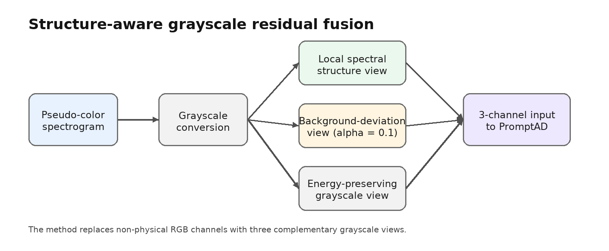
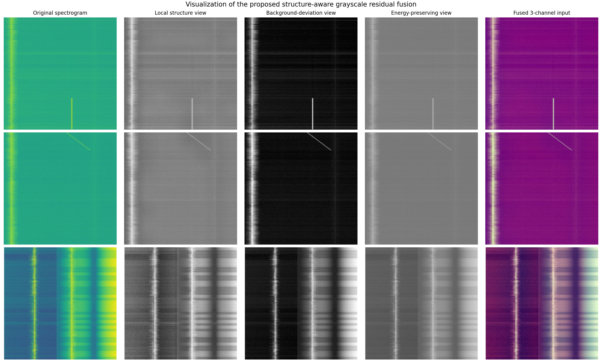

# 灰度残差频谱特征融合方案

## 1. 方案概述

当前采用的主方案为 **`morph_fusion_gray_residual_a01`**。该方法在 PromptAD 输入端对频谱图进行三通道重构，将原始 RGB 输入替换为更符合频谱异常检测任务的灰度结构表示。

方案示意图如下：



三通道定义如下：

```text
morph_fusion_gray_residual_a01 = gray_contrast + weak_residual(alpha=0.1) + original_gray
```

也就是说，模型输入不再依赖频谱图的伪彩色 RGB 映射，而是同时包含灰度强度、相对背景偏离和原始灰度保真信息。

## 2. 三个通道的含义

| 通道 | 名称 | 含义 |
|---|---|---|
| 第 1 通道 | `gray_contrast` | 对原始灰度频谱图做局部结构增强 |
| 第 2 通道 | `weak_residual(alpha=0.1)` | 基于频率行背景中位数构造的轻量残差增强图 |
| 第 3 通道 | `original_gray` | 原始灰度频谱图 |

对应特征图示例如下：



`gray_contrast` 用于增强低对比度结构，使弱频谱变化更容易被模型感知。该通道保留原图整体形态，但提高局部灰度差异。

`weak_residual(alpha=0.1)` 用于描述频谱图中相对于稳定背景的偏离。具体做法是：对每一条频率行估计时间方向的中位背景，再计算当前像素与该背景之间的差异，并以较小权重叠加回灰度图。这里使用 `alpha=0.1`，是为了避免残差过强导致正常背景纹理也被放大。

`original_gray` 用于保留原始频谱图的信息分布。加入这一通道的原因是，频谱图本身的能量形态仍然是重要信息，不能完全替换成增强图或残差图。

## 3. 方法动机

频谱图中的异常并不主要依赖颜色，而是依赖时频平面上的强度变化和结构变化。原始 RGB 图像通常来自灰度或功率图的颜色映射，三个颜色通道并不一定提供独立的物理信息。因此，本方案将 RGB 输入替换为三个更直接的频谱灰度视角。

该方法希望同时满足三个要求：

```text
保留原始频谱图的强度分布
增强弱异常和局部结构
不依赖异常类型先验
```

其中第三点很关键。实际应用中，模型在推理前通常不知道异常是 burst、chirp 还是 dsss，因此最终方案不能依赖“先判断异常类型，再选择特征提取方法”的流程。`morph_fusion_gray_residual_a01` 对所有纳入实验的异常类型使用同一个输入变换，因此更适合作为统一特征融合方案。

## 4. weak residual 的计算

设原始灰度频谱图为 `I`，对每个频率行计算时间方向的中位数背景：

```text
B(f) = median_t I(f, t)
```

残差信息为：

```text
R(f, t) = |I(f, t) - B(f)|
```

最终的轻量残差图为：

```text
I_res(f, t) = normalize(I(f, t) + 0.1 * R(f, t))
```

这里的 `0.1` 是残差增强权重。实验中发现，较大的残差权重会增强部分异常，但也容易放大正常背景中的细纹和场景差异；较小权重能够更稳地补充异常偏离信息。

## 5. 实验结果

实验协议：

```text
数据集：自测频谱图数据集
异常类型：burst_signal, chirp_signal, dsss_signal
训练协议：normal_75_25
训练集：75% normal 样本
测试集：25% normal 样本 + 全部 abnormal 样本
seed：111
epochs：50
prompt_mode：rf
```

主结果如下：

| 方法 | burst_signal | chirp_signal | dsss_signal | 三类平均 |
|---|---:|---:|---:|---:|
| RGB baseline | 86.3117 | 78.7308 | 96.4883 | 87.1769 |
| `morph_fusion_gabor_residual` | 90.0117 | 85.3342 | 95.3358 | 90.2272 |
| `morph_fusion_gray_residual_a01` | 90.0708 | 84.9758 | 96.6483 | 90.5650 |

与 RGB baseline 相比，当前方案在三类平均 AUC 上从 `87.1769` 提升到 `90.5650`，提升 `+3.3881`。

与之前的 Gabor 融合方案相比，当前方案的三类平均 AUC 从 `90.2272` 提升到 `90.5650`。其中，`dsss_signal` 从 `95.3358` 提升到 `96.6483`，解决了 Gabor 通道在 DSSS 上带来的性能下降问题；`burst_signal` 基本持平；`chirp_signal` 略有下降，但仍明显高于 RGB baseline。

## 6. 当前结论

`morph_fusion_gray_residual_a01` 是当前更适合作为主线的方法。它的优势不是针对某一种异常单独优化，而是在统一输入变换下兼顾三类异常。

该方案可以概括为：

```text
灰度保真 + 局部结构增强 + 轻量背景残差
```

从实验结果看，该方法能够在保持 DSSS 性能不低于 baseline 的同时，继续保留 burst 和 chirp 上的大部分提升。因此，当前后续实验、表格和文档都以该方案作为主推方案。

## 7. 公开数据补充验证

为了验证当前统一方案是否也适用于公开频谱异常数据，补充在 `RF_SPE_PNG` 协议上进行了测试。

公开数据协议不是四场景 `75/25`，而是：

```text
训练正常样本：RF_Spectrum_Public_Dataset 中按目录排序后的前 k_shot=1 个 MeasRes_* 目录
测试正常样本：剩余 MeasRes_* 目录中的全部 patch
测试异常样本：RF_SPE_PNG/{class}/abnormal/m40db 下全部异常图像
```

这里与当前主线最对应的三类公开异常是：

```text
burst
chirp
dsss
```

补充实验配置：

```text
dataset = rf_spe_png
noise level = m40db
seed = 111
epochs = 50
prompt_mode = rf
input_mode = morph_fusion_gray_residual_a01
```

结果汇总见：

```text
analysis_outputs/public_gray_residual_a01/m40_comparison.csv
analysis_outputs/public_gray_residual_a01/summary.md
```

主结果如下：

| 异常类型 | RGB baseline | 历史探索输入 | 当前 `gray_residual_a01` | 相对 baseline |
|---|---:|---:|---:|---:|
| `burst` | 81.97 | 84.31 | 88.47 | +6.50 |
| `chirp` | 98.90 | 98.97 | 99.30 | +0.40 |
| `dsss` | 67.70 | 69.21 | 71.88 | +4.18 |
| **平均** | **82.86** | **84.16** | **86.55** | **+3.69** |

这组公开数据结果说明两点。

第一，当前统一方案在公开 `m40db` 低信噪比条件下仍然有效，不只是对自测数据集有效。尤其是 `burst` 和 `dsss`，相对 RGB baseline 仍有明显提升。

第二，当前统一方案在这组三类公开异常上也优于早期探索阶段的一组非统一输入设置。这里不再把 selection 作为主线方法，因为 selection 依赖异常类型先验，不符合实际生产场景。当前结论只强调：`morph_fusion_gray_residual_a01` 在不预先知道异常类型的条件下，对自测数据和公开数据都能带来稳定提升。
